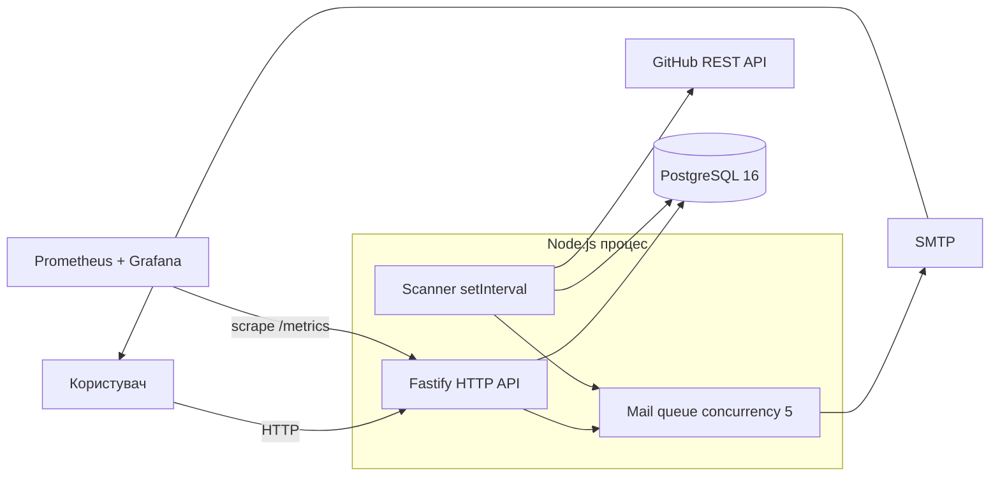
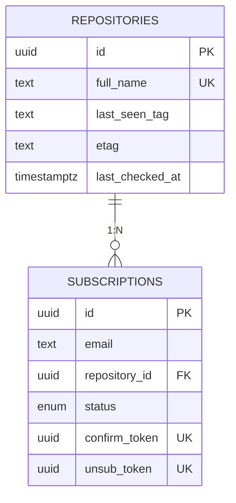
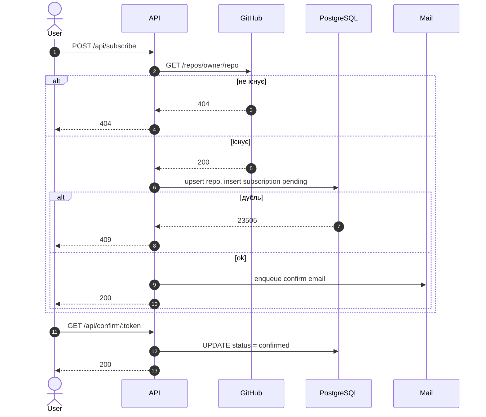
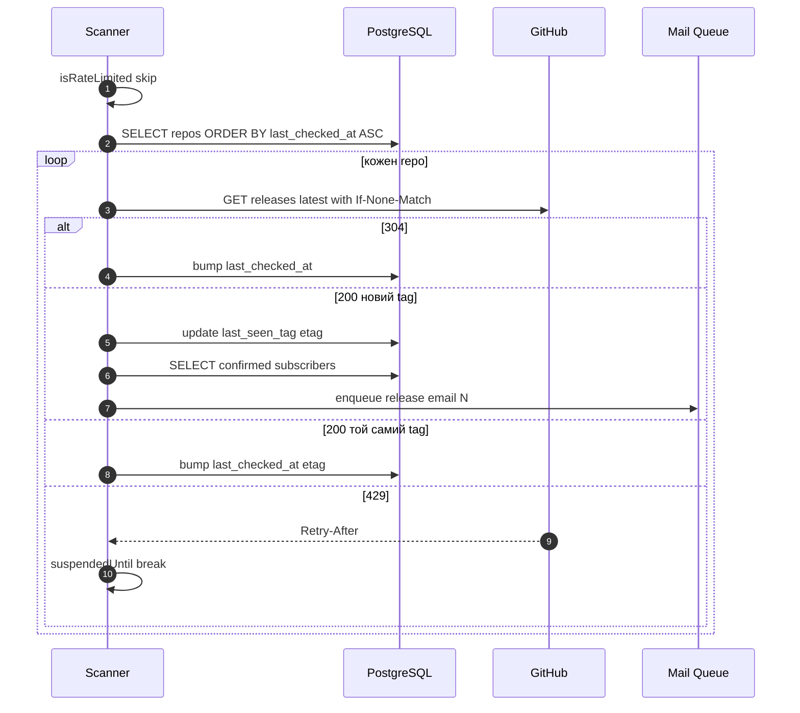

# System Design — GitHub Release Notifier

## 1. Огляд

Сервіс надсилає email-нотифікації про нові релізи в публічних GitHub-репозиторіях.
Користувач підписується на `owner/repo`, підтверджує підписку через лист, після чого
отримує лист на кожен новий тег релізу. Власником репозиторію бути не треба, тому
GitHub-події збираються через polling REST API з ETag-кешуванням і повагою до rate
limit.

## 2. Вимоги

| Тип               | Вимога                                                                  |
| ----------------- | ----------------------------------------------------------------------- |
| Затримка          | детекція релізу ≤ `SCAN_INTERVAL` хв (default 5)                        |
| Доставка          | at-least-once для нотифікацій; дублікат прийнятний, втрата — ні         |
| GitHub rate limit | сканер призупиняється до `Retry-After` / `x-ratelimit-reset`            |
| Локальний запуск  | `docker compose up` піднімає весь стек з міграціями                     |
| Спостережуваність | Prometheus `/metrics`, дашборди Grafana                                 |
| Безпека секретів  | токени тільки в env                                                     |

Поза скоупом поточної версії: webhooks, мульти-інстансний deploy, дайджести,
дедуплікація між інстансами.

## 3. Контекст і контейнери



API і сканер живуть в одному процесі. Це усвідомлений вибір: спрощує операційну
модель і робить транзакційно простими дії «детектувати реліз → поставити листи в
чергу».

## 4. Компоненти

Плагіни Fastify завантажуються шарами, кожен наступний бачить декоратори попередніх:

```
config → infrastructure → repositories → services → modules
```

| Шар              | Відповідальність                                  |
| ---------------- | ------------------------------------------------- |
| `config`         | Валідація env                                     |
| `infrastructure` | Клієнти зовнішніх систем: БД, Octokit, Nodemailer |
| `repositories`   | Типобезпечні запити через Kysely                  |
| `services`       | Інтеграція з GitHub і поштою                      |
| `modules`        | Доменна логіка: `subscription`, `scanner`         |

## 5. Модель даних



**Інваріанти**

- `UNIQUE(email, repository_id)` — одна підписка на пару.
- `confirm_token`, `unsub_token` — UUID `gen_random_uuid()`, неперебірні.
- `etag`, `last_seen_tag`, `last_checked_at` оновлюються однією транзакцією.
- `subscription_status`: `pending → confirmed`, відписка — hard-delete рядка.

## 6. Ключові потоки

### 6.1 Підписка



### 6.2 Сканування



ETag дає `304 Not Modified` без витрат rate limit, тож стеля polling-у — десятки
тисяч репозиторіїв на один токен.

## 7. Failure modes і operability

| Сценарій                       | Поведінка                                                                |
| ------------------------------ | ------------------------------------------------------------------------ |
| GitHub `429`                   | сканер ставить `suspendedUntil`, виходить з циклу                        |
| GitHub `404` (немає релізів)   | тихий skip, оновлюється `last_checked_at`                                |
| SMTP падає                     | помилка логується, інші листи в `Promise.all` йдуть далі                 |
| Краш процесу під час розсилки  | частина листів не доходить — відоме обмеження поточної версії            |
| Дубль `(email, repo)`          | БД повертає `23505`, API → `409`                                         |
| Перезапуск сканера             | `last_seen_tag` у БД захищає від «фантомних» нотифікацій                 |
| `SIGTERM`                      | mail-черга дочікується перед закриттям HTTP                              |

Логи — `pino` JSON. Метрики — `@fastify/metrics`. Алерти, які варто додати: 5xx
rate, час останнього успішного scan, глибина mail-черги, тривалий
`suspendedUntil`.

## 8. Безпека

- GitHub PAT — `public_repo` або без scope; лише в env.
- Confirm/unsub токени — UUID v4, ~122 біти ентропії; підтвердження одноразове,
  після видалення рядка unsub-токен інвалідний.
- `GET /api/subscriptions?email=...` без auth — свідоме спрощення, у проді
  потребує авторизації.
- CORS, rate-limit на API — поза скоупом поточної версії.

## 9. Майбутня еволюція

Зараз система — монолітний Node-процес, але архітектура свідомо тримає чисті межі:
HTTP API, сканер і mail-розсилка не діляться внутрішнім станом, а лише записами в БД
і чергою. У майбутньому система буде розділена на кілька окремих сервісів навколо
цих меж.
